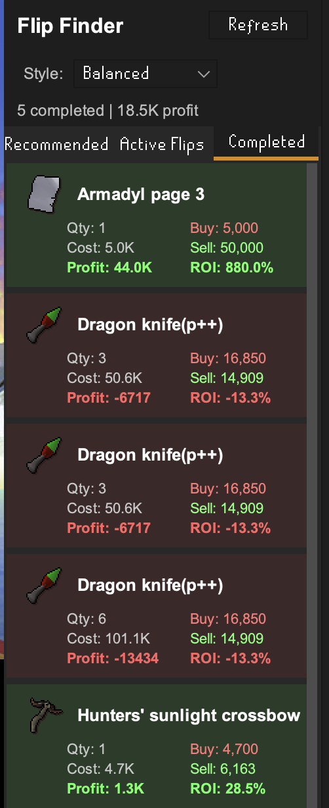
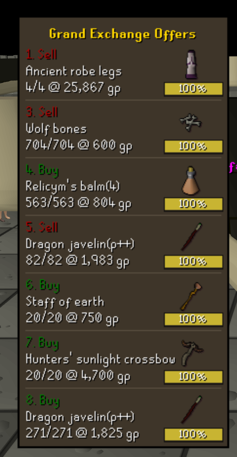

# Flip Smart RuneLite Plugin

A RuneLite plugin that helps you find profitable items to flip in the Grand Exchange and automatically tracks your flipping progress.

## 🔐 Authentication Required

This plugin requires a **Flip Smart account** to use. You'll need to:

1. Create an account on [Flip Smart](https://flipsm.art)
2. Configure your credentials in the plugin settings:
   - Open RuneLite configuration (wrench icon)
   - Find "Flip Smart" and configure
   - Enter your **Email** and **Password**

Without authentication, the plugin will not function.

## ✨ Features

### 📊 Flip Finder Panel

A dedicated sidebar panel with three tabs to help you flip smarter:

#### **Recommended Flips**
- Get personalized flip recommendations based on your cash stack
- Choose your flip style: **Conservative**, **Balanced**, or **Aggressive**
- See detailed information for each flip:
  - Recommended buy and sell prices
  - Expected profit and ROI
  - Item quantity and GE buy limit
  - Liquidity and risk ratings
- Click any item to see more details

#### **Active Flips**
- Automatically tracks items you've bought and are holding
- Shows current profit potential with live market prices
- Displays your total investment across all active flips
- See pending GE buy orders that haven't filled yet
- Right-click to dismiss flips you no longer want to track

#### **Completed Flips**
- View your completed flip history
- See profit/loss for each completed flip
- Track your flipping performance over time
- Click to expand and see flip duration and GE tax paid

### 📊 Grand Exchange Offer Overlay

A real-time on-screen display that shows all your active GE offers at a glance:

- **Live offer tracking**: See all 8 GE slots with their current status
- **Progress bars**: Visual progress showing how much of each offer has filled
- **Item details**: Item names, icons, quantities, and prices
- **Buy/Sell indicators**: Color-coded to easily identify buy (green) vs sell (red) offers
- **Movable & collapsible**: Click the coin icon to collapse/expand, drag to reposition
- **Auto-hide empty slots**: Only shows active offers for a clean interface

Perfect for monitoring multiple flips simultaneously without opening the GE interface!

### 🎯 Grand Exchange Integration

The plugin automatically monitors your Grand Exchange activity:
- **Detects buy orders** when you purchase items
- **Detects sell orders** when you sell items
- **Tracks profit/loss** automatically
- **Links recommended prices** to your trades for better tracking

### 💰 Smart Recommendations

Flip recommendations are tailored to your playstyle:

- **Conservative**: Low-risk, high-liquidity items with steady profits
- **Balanced**: Mix of safety and profitability
- **Aggressive**: Higher margins with more risk

Recommendations consider:
- Your available cash stack
- Item liquidity (trade volume)
- Price volatility and risk
- ROI and profit margins
- GE buy limits

### 📈 Real-Time Market Data

All prices and calculations are based on live market data:
- Current buy and sell prices
- Net profit after 2% GE tax
- ROI percentages
- Trade volume and liquidity scores

## ⚙️ Configuration

Access settings by right-clicking "Flip Smart" in the plugin list:

### Authentication
- **Email**: Your Flip Smart account email (required)
- **Password**: Your account password (required)
- **API URL Override**: Optional - only set this to override the default production server (https://flipsm.art)

### Flip Finder
- **Enable Flip Finder**: Toggle the sidebar panel on/off
- **Flip Style**: Choose Conservative, Balanced, or Aggressive
- **Number of Recommendations**: How many flips to show (1-50)
- **Refresh Interval**: How often to update recommendations (1-60 minutes)
- **Minimum Profit**: Only show items above this profit threshold

### Display
- **Show GE Tracker**: Toggle the Grand Exchange offer overlay on/off
- **Show Item Names**: Display item names in the GE tracker
- **Show Item Icons**: Display item icons in the GE tracker
- **Show Detailed Info**: Show quantity, price per item, and total value in GE tracker
- **Show Overlay**: Toggle the info overlay on/off

### General
- **Track History**: Save flip history across sessions

## 🚀 Getting Started

1. **Install the plugin** in RuneLite
2. **Configure your credentials** in plugin settings (see Authentication section above)
3. **Open the Flip Finder panel** from the RuneLite sidebar
4. **Browse recommended flips** and choose items that fit your cash stack
5. **Buy items in the GE** - they'll automatically appear in the "Active Flips" tab
6. **Sell when ready** - completed flips move to the "Completed" tab

## 💡 Tips

- **Start small**: Test with low-cost items to get familiar with the plugin
- **Use the GE Overlay**: Keep the overlay open to monitor all your offers at a glance - click the coin icon to collapse it when not needed
- **Check Active Flips**: Monitor your active flips to see current profit potential
- **Use Recommended Prices**: When buying a recommended item, the plugin remembers the suggested sell price
- **Watch your cash**: The plugin considers your cash stack when recommending flips
- **Refresh recommendations**: Click the refresh button to get updated market data
- **Dismiss items**: Right-click active flips to remove items you no longer want to track

## 🎮 In-Game Usage

1. Open the **Flip Finder** panel from the RuneLite sidebar
2. Browse the **Recommended** tab for profitable flip opportunities
3. Click items to expand and see detailed stats
4. Go to the **Grand Exchange** and place your buy orders
5. The **GE Overlay** will show your offers in real-time on screen
6. When items fill, they appear in the **Active Flips** tab
7. When you sell items, they move to the **Completed** tab
8. Track your total profit in the Completed tab!

## 🛠️ Troubleshooting

**Plugin shows "Failed to fetch recommendations"**
- Check that your email and password are correct in settings
- Verify the API URL is accessible and correct
- Ensure you're logged into RuneLite

**No recommendations showing up**
- Make sure you have enough cash in your inventory
- Try lowering the "Minimum Profit" setting
- Check that you're logged into OSRS
- Try clicking the Refresh button

**Active flips not updating**
- Make sure you're at the Grand Exchange
- Verify the items actually filled (check GE interface)
- Try clicking Refresh in the Active Flips tab

**GE Overlay not showing**
- Check that "Show GE Tracker" is enabled in Display settings
- The overlay only shows when you have active GE offers (empty slots are hidden)
- Try repositioning the overlay - it may be off-screen
- Click the coin icon to expand if it's collapsed

## 📝 License

BSD 2-Clause License

## 🙏 Credits

Built with the [RuneLite Plugin Template](https://github.com/runelite/example-plugin)

Inspired by excellent RuneLite flipping plugins:
- [Flipping Utilities](https://github.com/Belieal/flipping-utilities) - Comprehensive GE flipping tracker
- [Flipping Co-pilot](https://github.com/cbrewitt/flipping-copilot) - AI-powered flip recommendations

---

**Happy flipping!** 🎉
